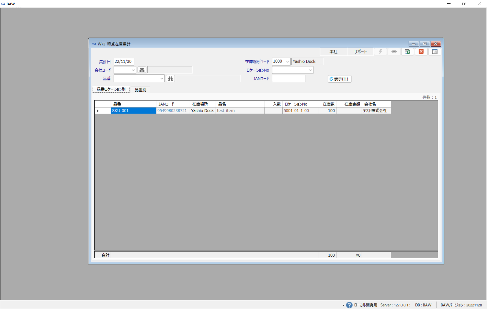
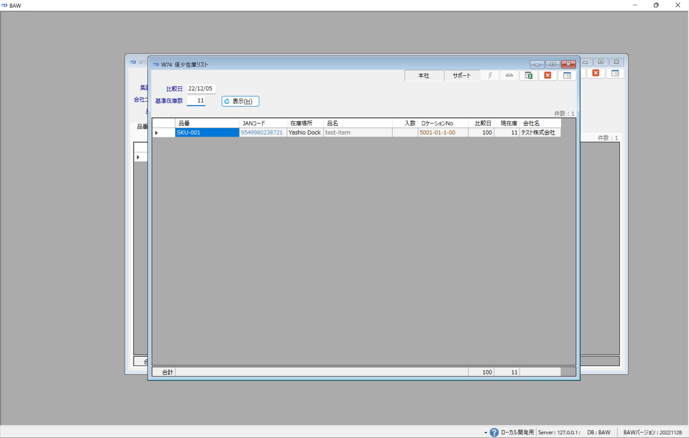

# 倉庫業務
- [倉庫業務](#倉庫業務)
  - [W70 在庫ロケーション一覧](#w70-在庫ロケーション一覧)
  - [W72 時点在庫集計](#w72-時点在庫集計)
  - [W74 僅少在庫リスト](#w74-僅少在庫リスト)
  - [W80 出荷実績集計](#w80-出荷実績集計)
  - [W82 入荷実績集計](#w82-入荷実績集計)
  - [W90 ロケーションマスタ](#w90-ロケーションマスタ)
  - [S80 商品在庫調整](#s80-商品在庫調整)
  - [S81 商品在庫調整一覧](#s81-商品在庫調整一覧)
## W70 在庫ロケーション一覧
1. サイドメニューの倉庫(W)から在庫ロケーション一覧(W70)を開きます。
2. 検索欄の条件に該当した在庫がロケーション別に表示されます。
3. [品番ロケーション別]のタブで検索すると品番,ロケでまとめられたデータが一覧で表示されます。
4. [品番ロケーション別、出荷期限別]のタブで検索すると品番,ロケ,出荷期限でまとめられたデータが一覧で表示されます。

## W72 時点在庫集計
1. サイドメニューの倉庫(W)から時点在庫集計(W72)を開きます。
2. [表示]ボタンをクリックすると集計日に入力した日付の入出荷後の最終在庫が表示されます。
3. [品番ロケーション別]のタブで検索すると品番,ロケでまとめられた在庫データが一覧で表示されます。
4. [品番別]のタブで検索すると品番でまとめられた在庫データが一覧で表示されます。

## W74 僅少在庫リスト
1. サイドメニューの倉庫(W)から僅少在庫リスト(W74)を開きます。
2. [表示]ボタンをクリックすると僅少在庫が表示されます。
3. 僅少在庫とはある比較日の在庫数と現在の在庫数を比較し、基準在庫数を**下回った**品番ロケを表示しています。

## W80 出荷実績集計
1. サイドメニューの倉庫(W)から出荷実績集計(W80)を開きます。
2. [表示]ボタンをクリックすると出荷済みステータスの実績が一覧で表示されます。

## W82 入荷実績集計
1. サイドメニューの倉庫(W)から入荷実績集計(W82)を開きます。
2. [表示]ボタンをクリックすると入荷済みステータスの実績が一覧で表示されます。

## W90 ロケーションマスタ
1. サイドメニューの倉庫(W)からロケーションマスター(W90)を開きます。
2. 在庫場所コードを選択し[表示]ボタンをクリックすると該当のロケ一覧が表示されます。
3. 画面右側の登録欄について説明します。
   1. ロケ新規登録
      1. 在庫場所コードを選択し、登録したいロケNoを入力します。
      2. 備蓄ロケまたは仮ロケーションとして登録したい場合はそれぞれチェックを付けます。
      3. [登録]ボタンをクリックします。
   2. ロケ区分修正
      1. 一覧から修正したいロケの行を選択します。
      2. 備蓄ロケまたは仮ロケーションのチェックを付けます。
      3. [更新]ボタンをクリックします。
   3. 引当優先順位修正
      1. 引当を優先したいロケの行を選択します。
      2. 修正したい引当順位を入力します。
      3. [更新]ボタンをクリックします。
   4. 削除
      1. 削除したいロケの行を選択します。
      2. [削除]ボタンをクリックします。既に在庫の履歴があるロケは削除出来ません。
   5. 

## S80 商品在庫調整
1. サイドメニューのその他(Z)から商品在庫調整登録(S80)を開きます。
2. 会社コード、品番を入力すると既存在庫が表示されます。
【既存在庫の調整をしたい場合】
3. 調整したい在庫行を選択します。
4. 調整数を入力します。プラスする時は[1]、マイナスする時は[-1]のように入力します。
5. 入荷訂正(入荷の実績数を変更する)場合は[入荷数訂正]のチェックを付けます。
6. [更新]ボタンをクリックします。
【新規在庫を追加したい場合】
7. [新規在庫の追加]欄に追加する在庫数、在庫場所コード、ロケーションNoを入力します。
8. [登録]ボタンをクリックします。

## S81 商品在庫調整一覧
1.  サイドメニューの入荷(S)から商品在庫調整登録(S81)を開きます。
2. 検索条件に合致した在庫調整履歴の一覧が表示されます。過去の在庫調整を確認したいときに活用ください。